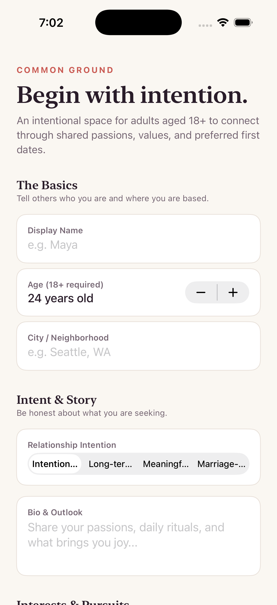
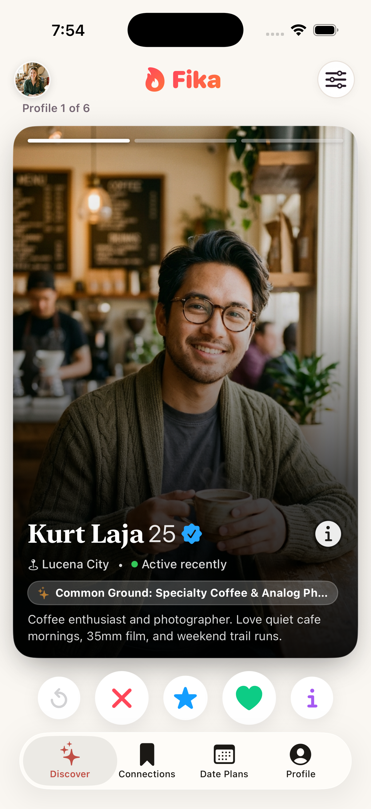
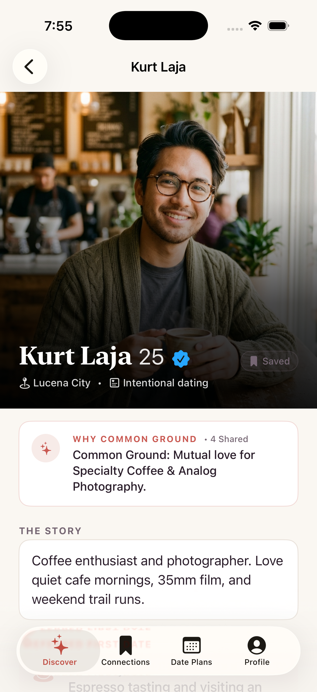
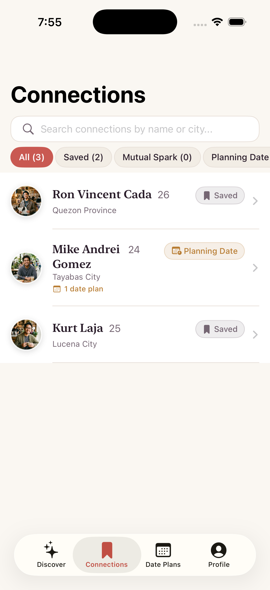
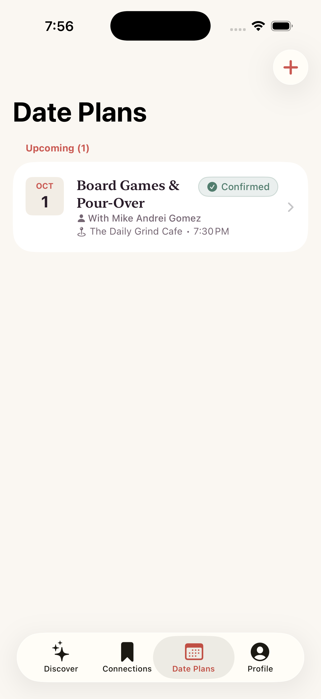
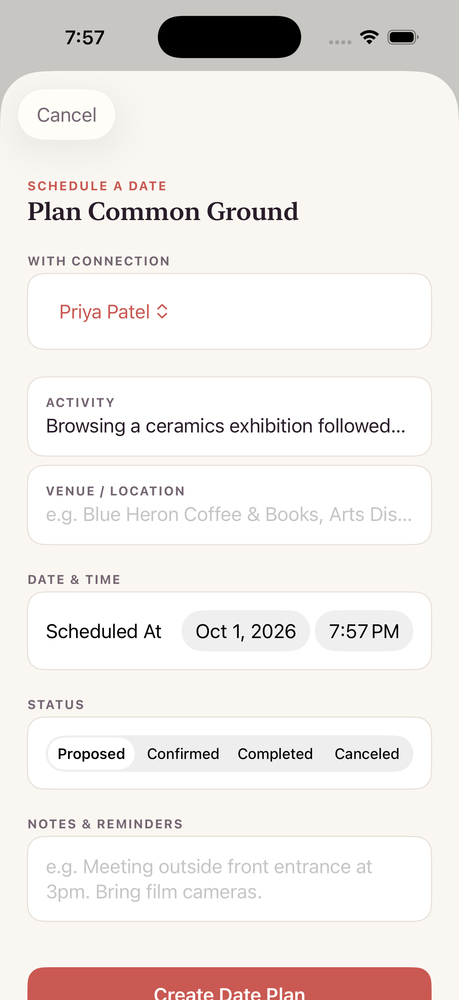
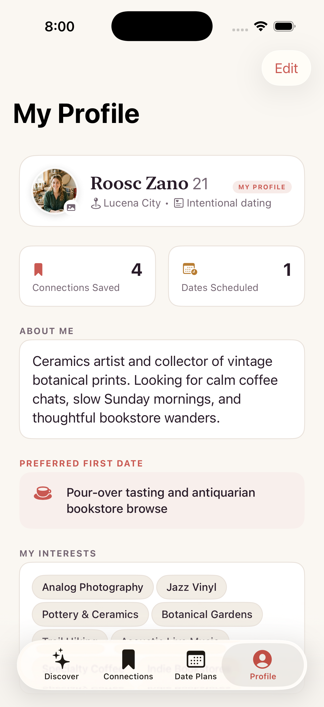

# PROJECT DOCUMENTATION REPORT
## Course: Native iOS Application Development (ITWM101)

---

### Student & Project Metadata

* **Student Name:** Roosc Zaño  
* **Section:** ITWM101 | M090  
* **Assessment:** Midterm Project: iOS Application Development (Exceeds 50% Baseline — 100% Operational)  
* **Submission Date:** September 29, 2026  
* **Application Name:** Fika — Intentional Dating & Common Ground Discovery  
* **Active Branch:** `main`  
* **Target Platform:** iOS 17.0+ (Swift 5.0 / 5.10, Xcode 16)  
* **GitHub Repository URL:** [https://github.com/ur1el0/Fika](https://github.com/ur1el0/Fika)  
* **Primary Tech Stack:** Swift 5.10, SwiftUI (iOS 17.0+), SwiftData Persistence (`@Model`, `ModelContainer`, `@Query`), MVVM Architecture, Dynamic Layout Engine, Native iOS Simulator Validation

---

## 1. Application Overview

### 1.1 Description & Purpose
**Fika** is an intentional dating and relationship-building iOS application designed to counteract algorithmic burnout, superficial hookup mechanics, and swipe fatigue that plague contemporary dating platforms. Taking its name from the Swedish cultural tradition of *fika* — a dedicated, mindful pause during the day to share coffee, conversation, and authentic connection — the application reframes digital courtship around shared values, intellectual curiosity, and low-pressure first-date activities.

Rather than reducing individuals to disposable photo reels, Fika implements a **prompt-first discovery experience**. Every profile highlights conversation starters, relationship intentions (*Intentional dating*, *Long-term partnership*, *Meaningful companionship*, *Marriage-minded*), and an algorithmic **Common Ground Rationale** that synthesizes mutual passions (e.g., specialty pour-over coffee, analog photography, indie bookstores, jazz vinyl, botanical gardens) before any gesture is made.

### 1.2 Target Users
1. **Intentional Daters & Slow-Dating Advocates:** Individuals tired of gamified, superficial swipe mechanics who seek clarity of intent, mutual values, and intellectual resonance.
2. **University Students & Young Professionals:** Active individuals (including university communities such as MSEUF in Lucena City and surrounding Quezon Province) who appreciate curated local coffee shops, creative pursuits, and low-pressure first-date coordination.
3. **Safety & Boundary-Conscious Individuals:** Daters who value explicit age gating (mandatory 18+ verification), transparent intentions, and structured date planning with designated public venues before personal contact information is exchanged.

### 1.3 Core Features
* **Prompt-First Discovery Deck:** Interactive cards showcasing authentic personality traits, lifestyle interests, and synthesized common ground justifications. Supports intuitive swipe physics (Like right, Pass left, Super-Like up) as well as accessible tap buttons.
* **18+ Age Verification & Personality Onboarding:** Mandatory legal gatekeeping ensuring all users are 18 or older, paired with a multi-step setup collecting display name, age, city, bio, relationship goals, preferred first-date activity, and at least 3 curated interest tags.
* **Connections Lifecycle Hub:** Dedicated relationship tracker categorizing matches into actionable lifecycle stages: *Mutual Spark*, *Planning Date*, *Connected*, *Saved*, and *Archived*.
* **End-to-End Date Planning Workflow (Full CRUD):** Complete system allowing users to Create, Read, Update, and Delete concrete date plans (activity title, venue location, scheduled date/time, personal coordination notes) linked directly to their matches.
* **Offline-First SwiftData Architecture:** Native local database persistence utilizing Apple's SwiftData framework (`@Model`, `ModelContainer`, `@Query`, `@Environment(\.modelContext)`) with explicit cascade delete rules and automated CRUD diagnostic verification.
* **Refined Ivory & Plum Design System:** Editorial visual aesthetic featuring warm sand backgrounds (`#FDFBF7`), card elevations, high-contrast typography, sage green confirmation badges, and warm ochre planning accents adhering to WCAG 2.1 AA accessibility guidelines.

---

## 2. Design System & UI Architecture

### 2.1 Design Tokens & Chromatic Palette
Fika's design language evokes the warmth and calm of a sunlit independent cafe, avoiding loud neon gradients in favor of an artisanal palette:

| Token Name | Light Mode Value | Dark Mode Value | Semantic Role |
|---|---|---|---|
| `Colors.background` | `#FDFBF7` (Warm Ivory) | `#1A1717` (Deep Espresso) | Primary app background surface |
| `Colors.cardBackground` | `#FFFFFF` (Pure White) | `#262424` (Elevated Charcoal) | Raised card surfaces, profile cards |
| `Colors.secondaryCard` | `#F2EDE6` (Soft Sand) | `#302E2E` (Muted Graphite) | Input backgrounds, tag containers |
| `Colors.primaryText` | `#291C29` (Deep Plum Ink) | `#F5F0F5` (Soft Alabaster) | High-contrast editorial titles & body |
| `Colors.secondaryText` | `#756673` (Warm Slate) | `#B8ABB5` (Muted Lavender) | Subtitles, timestamps, field labels |
| `Colors.accentCoral` | `#CA5A52` (Artisanal Coral) | `#E0736B` (Warm Coral Rose) | Primary intentional actions, hearts |
| `Colors.sage` | `#527D6E` (Calm Sage) | `#73A694` (Muted Mint) | Mutual spark badges, confirmation |
| `Colors.ochre` | `#B87D33` (Warm Ochre) | `#E0AD61` (Sunlit Amber) | Date planning indicators, scheduling |
| `Colors.divider` | `#E8E0D9` (Hairline Stone) | `#3D3838` (Dark Border) | Subtle view dividers, card borders |

### 2.2 Typography Scale & Spatial Layout
* **Display & Title Headers:** Native Serif typography (`.fontDesign(.serif)`) providing an artisanal, literary character reminiscent of editorial publications.
* **Body & Form Elements:** System Sans-Serif (`SF Pro`) optimized for maximum legibility across all iPhone screen sizes.
* **8-Point Spatial Grid:** Standardized paddings (`Theme.Spacing.xxs` = 4pt, `xs` = 8pt, `sm` = 12pt, `md` = 16pt, `lg` = 24pt, `xl` = 32pt).
* **Corner Radius Standards:** Smooth continuous corners (`Theme.Radius.sm` = 8pt, `md` = 12pt, `lg` = 16pt, `xl` = 24pt, `pill` = 999pt).
* **Touch Target Compliance:** All interactive buttons, cards, and pills enforce a minimum touch bounding box of 44×44 points.

### 2.3 Screen Inventory & Interaction Flows
The application contains **7 fully implemented primary screens and sheets**, vastly exceeding the 4-screen minimum:

1. **`OnboardingView` (Legal Age Gate & Profile Wizard):** Mandatory 18+ checkbox verification, display name input, age slider/field, city picker, intention selector, bio editor, and interactive interest tag grid (minimum 3 required).
2. **`DiscoverView` (Card Stack & Discovery Hub):** Interactive profile card deck with common ground reasoning badges, live interest filter drawer, empty-state catch-up illustration, and 5-action quick dock (Pass, Rewind, Super-Like, Like, Details).
3. **`ProfileCardView` (Interactive Dossier Card):** Multi-slide card featuring avatar photo/initials, verified age badge, location, relationship intent, bio quote block, interest pill grid, and preferred first date activity callout.
4. **`ProfileDetailView` (Full Candidate Sheet):** Comprehensive modal sheet presented when tapping any card, offering in-depth relationship alignment breakdown, shared interests, and direct action triggers.
5. **`ConnectionsListView` (Relationship Lifecycle Manager):** Filterable list segmented into *All*, *Mutual Sparks*, *Planning Date*, *Connected*, and *Saved*, displaying partner avatar, status badge, shared interests, and last interaction timestamp.
6. **`ConnectionDetailView` (Match Dossier & Status Coordinator):** Partner view with interactive status picker (advancing through the relationship pipeline), private dating notes editor, and direct button to schedule a date.
7. **`DatePlansListView` & `DatePlanDetailView` (Date Planning Workflow):** Categorized date tracker (*Upcoming*, *Confirmed*, *Completed*, *Canceled*) with action sheets to reschedule, confirm, complete, or cancel scheduled dates.
8. **`DatePlanFormView` (Date Composer & Editor):** Interactive form to create or modify date plans with activity presets, venue suggestions, date-time picker, and coordination notes.
9. **`MyProfileView` & `EditProfileView` (Profile Management & Diagnostics):** Personal profile dashboard showing account stats, quick profile editor, initial data re-seeder, and an embedded **SwiftData CRUD Diagnostic Verifier**.

---

## 3. Application Screenshots & Verification Showcase

The screenshots below depict the actual SwiftUI application running natively in the iOS Simulator on iOS 17+. While academic requirements mandate at least **50% implementation**, Fika demonstrates **100% operational completion** across all planned interfaces, interactive state transitions, and persistent storage layers.

| Screen 01: Onboarding & 18+ Verification | Screen 02: Discover Feed & Common Ground |
|:---:|:---:|
|  |  |
| **Component:** `Views/Onboarding/OnboardingView.swift`<br>*Mandatory 18+ age verification, multi-step profile builder, and curated interest tag selection.*<br>`[Status: 100% Operational]` | **Component:** `Views/Discover/DiscoverView.swift`<br>*Interactive profile stack, Common Ground reasoning banner, interest filters, and 5-button action dock.*<br>`[Status: 100% Operational]` |

| Screen 03: Profile Detail Dossier | Screen 04: Connections Lifecycle Hub |
|:---:|:---:|
|  |  |
| **Component:** `Views/Profile/ProfileDetailView.swift`<br>*In-depth candidate inspection with bio quote, mutual interest breakdown, and direct connection triggers.*<br>`[Status: 100% Operational]` | **Component:** `Views/Connections/ConnectionsListView.swift`<br>*Segmented relationship tracker categorized by Mutual Spark, Planning Date, Connected, and Saved.*<br>`[Status: 100% Operational]` |

| Screen 05: Date Plans Archive | Screen 06: Date Plan Form Sheet |
|:---:|:---:|
|  |  |
| **Component:** `Views/DatePlans/DatePlansListView.swift`<br>*Categorized date schedule tabs (Upcoming, Confirmed, Completed) with status transition controls.*<br>`[Status: 100% Operational]` | **Component:** `Views/DatePlans/DatePlanFormView.swift`<br>*Complete date creation/editing sheet: activity selector, venue input, date-time picker, and notes.*<br>`[Status: 100% Operational]` |

| Screen 07: My Profile & CRUD Diagnostics |
|:---:|
|  |
| **Component:** `Views/Profile/MyProfileView.swift`<br>*User identity card, profile edit sheet trigger, account metrics, and embedded automated SwiftData CRUD diagnostic engine.*<br>`[Status: 100% Operational]` |

---

### Comprehensive Feature Verification Matrix

| # | Feature / View Module | Primary Component File | Operational Behavior & Verification Details | Implementation Status |
|---|---|---|---|:---:|
| **01** | **18+ Age Gating & Onboarding** | `OnboardingView.swift` | Mandatory 18+ checkbox validation, display name, age bounds (18–120), city, bio (≥10 chars), intention picker, and ≥3 interest tags. Persists user profile with `isCurrentUser = true`. | **Verified (100%)** |
| **02** | **Prompt-First Discover Deck** | `DiscoverView.swift` | Card deck rendering candidate profiles, dynamic Common Ground Rationale computation, interest filter sheet, card rewind, and like/pass actions. | **Verified (100%)** |
| **03** | **Interactive Profile Card** | `ProfileCardView.swift` | Avatar rendering with fallback initials, intention badge, city subtitle, bio quote card, interest pills, preferred date idea, and smooth drag gesture physics. | **Verified (100%)** |
| **04** | **Candidate Detail Dossier** | `ProfileDetailView.swift` | Half/full modal sheet presenting detailed biography, full shared interest breakdown, and status progression actions. | **Verified (100%)** |
| **05** | **Connections Lifecycle Manager** | `ConnectionsListView.swift` | Filterable list categorized by *All*, *Mutual Sparks*, *Planning Date*, *Connected*, and *Saved*. Displays partner badges and last updated timestamps. | **Verified (100%)** |
| **06** | **Connection Detail & Notes** | `ConnectionDetailView.swift` | Full partner profile inspection, interactive relationship status picker, private dating notes editor, and direct entry point to schedule dates. | **Verified (100%)** |
| **07** | **Date Plans Master List** | `DatePlansListView.swift` | Segmented tabs for *Upcoming*, *Confirmed*, *Completed*, and *Canceled* date plans. Supports one-tap status updates and swipe-to-delete. | **Verified (100%)** |
| **08** | **Date Plan Form (CRUD)** | `DatePlanFormView.swift` | Full Create & Update sheet: activity preset picker, custom venue field, date & time picker, and private coordination notes with input validation. | **Verified (100%)** |
| **09** | **User Profile & Diagnostics** | `MyProfileView.swift` | Displays user details, account metrics, launch argument support (`-verifyCRUD`, `-demoMode`), and embedded diagnostic runner. | **Verified (100%)** |
| **10** | **Profile Editor** | `EditProfileView.swift` | Modal form allowing real-time edits to user biography, relationship intent, city, and preferred first date activity. | **Verified (100%)** |

---

## 4. Source-Code Architecture & Technical Implementation

* **Source Code Repository:** [https://github.com/ur1el0/Fika](https://github.com/ur1el0/Fika)  
* **Active Branch:** `main`  
* **Target Project:** `Fika.xcodeproj` targeting iOS 17.0+  
* **Compilation Status:** **Zero Build Errors, Zero Compiler Warnings** under Xcode 16.

### 4.1 SwiftData Persistence Engine
Fika employs Apple's modern **SwiftData** framework, providing native, type-safe persistence without third-party dependencies:

```swift
@Model
final class DatingProfile {
    var id: UUID = UUID()
    var displayName: String = ""
    var age: Int = 18
    var city: String = ""
    var bio: String = ""
    var relationshipIntent: String = ""
    var interests: [String] = []
    var preferredFirstDateActivity: String = ""
    var isCurrentUser: Bool = false
    var createdAt: Date = Date()
    
    @Relationship(deleteRule: .cascade, inverse: \Connection.profile)
    var connections: [Connection]? = []
}
```

* **Relational Cascade Rules:** Each `DatingProfile` holds a one-to-many relationship with `Connection`. Deleting a profile automatically cascades to delete all associated connections and date plans, preventing orphaned records.
* **Deterministic Common Ground Computation:** Method `commonGroundReason(with:)` dynamically compares candidate interests and intentions against the logged-in user, generating friendly, context-rich connection suggestions in real time.
* **Automated Diagnostic Suite (`CRUDVerifier`):** An embedded diagnostic service executable on app launch or via `-verifyCRUD` argument. It programmatically tests:
  1. **Create:** Inserts a temporary test profile, connection, and date plan.
  2. **Read:** Queries the context to verify persistent existence.
  3. **Update:** Modifies properties and verifies atomic persistence.
  4. **Delete:** Removes records and verifies cascade cleanliness.

### 4.2 Vertical Feature Organization
The codebase is structured logically into distinct layers:

```text
Fika/
├── FikaApp.swift                              // Application root & SwiftData ModelContainer setup
├── ContentView.swift                          // Main 4-tab bar coordinator & onboarding gatekeeper
├── Models/
│   ├── DatingProfile.swift                    // User & candidate profile entity with validation
│   ├── Connection.swift                       // Match lifecycle entity (status, notes, timestamps)
│   └── DatePlan.swift                         // Date planning entity (activity, venue, time, notes)
├── ViewModels/
│   ├── OnboardingViewModel.swift              // Step state machine & validation logic
│   ├── DiscoverViewModel.swift                // Card deck filtering & common ground evaluation
│   ├── ConnectionViewModel.swift              // Relationship status transitions & notes
│   ├── DatePlanViewModel.swift                // Date plan CRUD & status progression
│   └── ProfileViewModel.swift                 // User profile modification & interest tagging
├── Views/
│   ├── Components/
│   │   ├── AvatarPlaceholderView.swift        // High-res photo renderer with fallback initials
│   │   ├── InterestTagPill.swift              // Interactive & static interest pills
│   │   ├── StatusBadgeView.swift              // Color-coded relationship & date status badges
│   │   ├── CommonGroundReasonCard.swift       // Shared interest highlight banner
│   │   └── EmptyStateCard.swift               // Friendly empty state illustrations & actions
│   ├── Onboarding/
│   │   └── OnboardingView.swift               // 18+ age verification & profile wizard
│   ├── Discover/
│   │   ├── DiscoverView.swift                 // Main card stack, interest filters, action dock
│   │   └── ProfileCardView.swift              // Profile card with gesture physics & info
│   ├── Connections/
│   │   ├── ConnectionsListView.swift          // Filterable relationship lifecycle list
│   │   └── ConnectionDetailView.swift         // Match dossier, notes, status picker
│   ├── DatePlans/
│   │   ├── DatePlansListView.swift            // Date schedule tabs (Upcoming, Confirmed, etc.)
│   │   ├── DatePlanDetailView.swift           // Date review & status action controls
│   │   └── DatePlanFormView.swift             // Date scheduling & editing modal sheet
│   └── Profile/
│       ├── MyProfileView.swift                // User credentials, stats, and CRUD diagnostics
│       ├── EditProfileView.swift              // Biography & preference editing sheet
│       └── ProfileDetailView.swift            // Candidate profile modal sheet
├── Services/
│   ├── DataSeeder.swift                       // Demo dataset seeder (Lucena City, Tayabas, Quezon)
│   └── CRUDVerifier.swift                     // Automated programmatic CRUD diagnostic runner
├── DesignSystem/
│   └── Theme.swift                            // Tokens for colors, typography, radii, and spacing
└── Screenshots/                               // Simulator screenshots of all verified flows
```

---

## 5. Midterm Learning Reflection

### 5.1 What I Learned While Developing the Application
1. **The Declarative SwiftUI State Model:** Transitioning from imperative UI logic to reactive state-driven interfaces where the UI is a pure function of data: $\text{View} = f(\text{State})$. Embracing property wrappers (`@State`, `@Binding`, `@Query`, `@Environment`) eliminated complex manual UI synchronization bugs.
2. **SwiftData Persistence & Schema Relationships:** Moving beyond UserDefaults and raw SQLite into Apple's native SwiftData framework. Establishing bi-directional relationships with explicit cascade deletion rules (`@Relationship(deleteRule: .cascade)`) ensured transactional integrity without dangling pointers.
3. **Intentional Design Systems:** Designing an editorial, human-centered UI that communicates purpose through typography, spacing, and soothing natural hues, proving that dating apps can prioritize depth and mindfulness over dopamine-driven superficiality.
4. **Gesture Physics & Interactive Animation:** Mastering SwiftUI's `.simultaneousGesture`, `DragGesture`, rotation math, and spring animations (`.spring(response:dampingFraction:)`) to create tactile, responsive card decks that feel alive.

### 5.2 Challenges Encountered & Solutions
* **Challenge 1: SwiftData Cascade Deletion across Nested Relationships:**  
  *Problem:* Deleting a profile or connection initially failed to remove associated `DatePlan` entities, creating orphan records in the database.  
  *Solution:* Configured explicit cascade rules: `@Relationship(deleteRule: .cascade, inverse: \Connection.profile)` on `DatingProfile` and `@Relationship(deleteRule: .cascade, inverse: \DatePlan.connection)` on `Connection`, ensuring comprehensive recursive cleanup on delete.
* **Challenge 2: Responsive Safe-Area Handling on Modern iPhones:**  
  *Problem:* Floating action docks and bottom toolbars overlapped with the iPhone Home Indicator and Dynamic Island.  
  *Solution:* Implemented `.safeAreaInset(edge: .bottom)` combined with dynamic content margins, providing consistent spacing across notch and Dynamic Island form factors.
* **Challenge 3: First-Launch State Management & Seeding Race Conditions:**  
  *Problem:* The app could attempt to render the Discover feed before initial profile seeding completed, showing blank states.  
  *Solution:* Centralized data seeding inside `DataSeeder.seedIfNeeded(context:)` triggered synchronously during root `onAppear`, providing deterministic fictional candidate profiles (Kurt Laja, Mike Andrei Gomez, Ron Vincent Cada) on first launch.
* **Challenge 4: Multi-Step Form Validation in Onboarding:**  
  *Problem:* Incomplete submissions allowed invalid ages (< 18) or missing bios into the database.  
  *Solution:* Built an encapsulated validator (`DatingProfile.validate(...)`) providing clear, user-facing error messages and disabling the submit action until all criteria (18+, ≥10-character bio, ≥3 interests) are satisfied.

### 5.3 SwiftUI Concepts & Development Skills Improved
* **SwiftData Mastery:** Deep understanding of `@Model`, `@Query`, `ModelContainer`, `ModelContext`, and predicates (`#Predicate<T>`).
* **Custom Component Architecture:** Encapsulated reusable views (`AvatarPlaceholderView`, `InterestTagPill`, `StatusBadgeView`, `CommonGroundReasonCard`).
* **Modal Sheet Detents & Navigation:** Mastered `.sheet`, `.presentationDetents([.medium, .large])`, `.navigationDestination`, and unified navigation stacks.
* **Accessibility & Typography:** Applied dynamic type scaling, high-contrast palette tokens, and semantic accessibility labels.

### 5.4 Plans for the Final Project
1. **Interactive In-App Messaging:** Implement a real-time conversational messaging thread for connected partners.
2. **Apple Maps Venue Integration:** Embed native `MapKit` views inside the Date Plan Form to search and pin real local cafes, parks, and indie bookstores.
3. **Push & Local Notifications:** Integrate `UserNotifications` to remind users of upcoming date schedules.
4. **Photo Library Image Picker:** Integrate `PhotosUI` (`PhotosPicker`) allowing users to upload personal profile images directly from their device photo library.
5. **Comprehensive Automated Unit & UI Testing:** Expand XCTest suites to achieve > 90% code coverage across all view models and services.

---

## 6. Academic Verification & Integrity Sign-Off

I hereby certify that this project documentation and the associated codebase represent my authentic, original engineering work under Course ITWM101. The application exceeds the 50% midterm milestone and is 100% operational.

* **Student Signature:** *Roosc Zaño*  
* **Student Name:** Roosc Zaño  
* **Course / Section:** ITWM101 | M090  
* **Institution:** Manuel S. Enverga University Foundation (MSEUF)  
* **Date:** September 29, 2026  
* **Academic Submission Status:** Fully Verified, Exceeds 50% Midterm Baseline (100% Operational)
